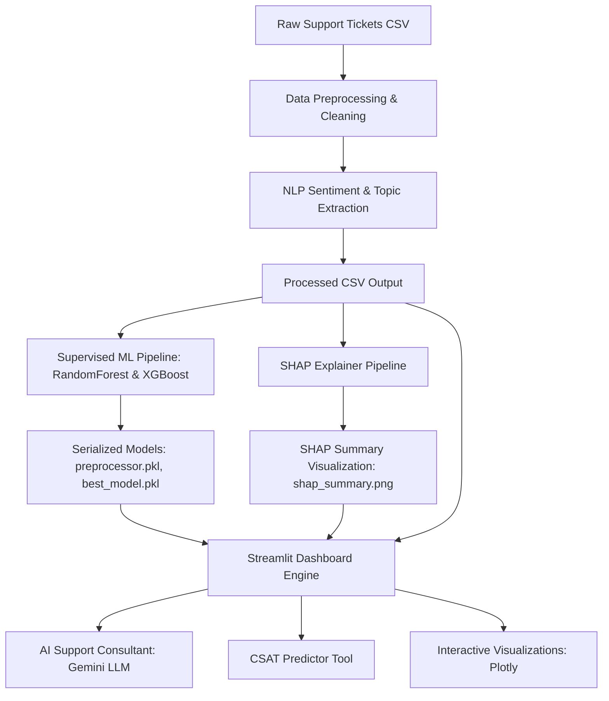

# Project Description: AI-Powered Customer Support Intelligence Platform

An end-to-end executive decision-support platform that applies Natural Language Processing (NLP), Supervised Machine Learning, Explainable AI (XAI), and Generative AI (LLMs) to optimize customer support operations and maximize Customer Satisfaction (CSAT).

---

## 1. Problem Statement

Customer support operations at scale face several critical challenges:
1. **Unstructured Data Overload**: Support tickets contain rich qualitative descriptions of user frustration, but manual review is slow, expensive, and fails to scale.
2. **Delayed Insights**: Standard dashboards only report historical statistics (e.g., ticket count, response time), telling managers *what* happened but failing to explain *why* customer satisfaction is low or *which* products are driving friction.
3. **Proactive Intervention Gap**: Support leads cannot predict customer satisfaction before the rating is submitted, preventing them from intercepting high-risk escalations in real-time.
4. **Actionable Operations Advice**: Raw metrics do not directly translate into management action. Support leads need immediate operational checklists (e.g., staffing, triage priority, SLA adjustments) based on live analytics.

---

## 2. Proposed Solution

This platform builds an end-to-end analytical pipeline to bridge the gap between raw ticket logs and executive action:
* **Real-time Feature Pipeline**: Automatically cleans ticket dates, bins customer demographic data, and computes durations (First Response Time, Resolution Duration).
* **NLP Intelligence**: Gauges user sentiment score via VADER sentiment analysis, and groups tickets into complaint topic clusters.
* **Supervised Satisfaction Predictor**: Trains Random Forest and XGBoost regressors on historic logs to predict live customer satisfaction rating (1-5 stars).
* **Explainable AI (SHAP)**: Employs game-theoretic Shapley values to visualize feature importances, showing support leads exactly what operational or product variables shift satisfaction.
* **Generative AI (Gemini)**: Serves as a virtual "AI Support Consultant" providing:
  * Dynamic ticket categorization and summaries.
  * Automated operations checklists and recommendations.
  * Interactive natural-language Q&A over aggregated metrics.
  * Step-by-step resolution and troubleshooting procedures.

---

## 3. Data Flow & System Architecture

The following sequence illustrates the pipeline flow of customer support tickets within the platform:



### 1. Ingestion & Preprocessing
* Raw customer tickets (`customer_support_tickets.csv`) are loaded.
* Fields cleaned include `Date of Purchase` (converted to datetimes) and duration calculations.
* Response metrics are binned into human-readable buckets (e.g., "0-1 Hours", "1-3 Hours") and time elapsed since operational launch is normalized.

### 2. Natural Language Processing (NLP)
* **VADER Sentiment Indexing**: Support ticket body texts are analyzed to produce positive, negative, and neutral ratios. A compound sentiment score ranging from `-1.0` (highly negative) to `+1.0` (highly positive) is assigned to each ticket.
* **Topic Classification**: Tickets are assigned categories such as "Product Setup", "Billing", "Account Access", "Hardware", and "Software" based on text-mining classifications.

### 3. Model Training & Serialization
* Preprocessed features are split into training/test sets.
* Categorical values are One-Hot Encoded, and numerical variables are standardized using a pipeline.
* **Random Forest Regressor** and **XGBoost Regressor** models are fitted to predict customer satisfaction ratings (continuous target 1-5).
* The best model is selected based on $R^2$ score and serialized as `best_model.pkl` along with its training `preprocessor.pkl`.

### 4. Explainability (SHAP)
* A SHAP TreeExplainer computes the Shapley value contributions of each feature.
* A global summary plot (`shap_summary.png`) is written to disk, illustrating which factors (e.g., Response Time, Product Type, Sentiment Score) drag satisfaction down or boost it.

### 5. Web Interface (Streamlit)
* Loads the processed data and serialized model artifacts.
* Displays dashboard screens: Executive Summary, Product Insights, CSAT drivers, channel effectiveness, friction products, SLA performance, and customer segmentation.
* Hosts the **AI Support Consultant** using Gemini to evaluate metrics and tickets.
* Implements the **CSAT Prediction Tool** for testing theoretical configurations.

---

## 4. Detailed Technical Concepts

### A. Sentiment Analysis (NLTK VADER)
* **Valence Aware Dictionary and sEntiment Reasoner (VADER)**: A lexicon and rule-based sentiment analysis tool that is specifically attuned to sentiments expressed in social media and customer feedback contexts.
* **Compound Score Calculation**: The compound score is computed by summing the valence scores of each word in the lexicon, adjusted according to rules (such as capitalization, exclamation marks, and degree modifiers), and then normalized between -1 and +1:
  $$S_{\text{compound}} = \frac{S_{\text{raw}}}{\sqrt{S_{\text{raw}}^2 + \alpha}}$$
  where $S_{\text{raw}}$ is the sum of valence ratings and $\alpha$ is a normalization constant (typically 15).

### B. Supervised Regression (Random Forest & XGBoost)
* **Random Forest Regressor**: An ensemble bagging algorithm. It constructs multiple decision trees during training and averages their outputs to make a final prediction. This controls overfitting and handles high-dimensional sparse representations from One-Hot Encoding extremely well.
* **XGBoost Regressor (Extreme Gradient Boosting)**: A boosting algorithm that fits trees sequentially, where each new tree aims to minimize the residual errors (gradients) of the previous ensemble. It optimizes a regularized objective function:
  $$\mathcal{L}^{(t)} = \sum_{i=1}^n l(y_i, \hat{y}_i^{(t-1)} + f_t(x_i)) + \Omega(f_t)$$
  where $\Omega(f_t)$ penalizes tree complexity to prevent overfitting, offering fast training and high predictive accuracy.

### C. Game-Theoretic Explainability (SHAP)
* **Shapley Additive exPlanations (SHAP)**: Explains the output of a machine learning model by assigning each feature a value representing its contribution to that prediction. Shapley values are calculated by evaluating the model across all possible feature subsets:
  $$\phi_i = \sum_{S \subseteq F \setminus \{i\}} \frac{|S|!(|F| - |S| - 1)!}{|F|!} \left[ f(S \cup \{i\}) - f(S) \right]$$
  This mathematical foundation ensures that the explanation is fair and satisfies mathematical properties: Efficiency, Symmetry, Dummy, and Additivity.

### D. LLM Orchestration & Prompt Context Feeding
* **Google Gemini 2.5 Flash API**: Leveraged through the modern `google-genai` SDK.
* **Contextual Metric Injection**: Rather than passing raw ticket databases to the LLM (which is expensive and exceeds context limit efficiency), pandas metrics are aggregated into small JSON arrays (e.g., mean resolution times per product, CSAT breakdown per channel). These summary strings are injected into system prompts as structural knowledge:
  ```json
  {
    "channel_performance": {"Email": 3.1, "Chat": 4.5, "Phone": 4.2},
    "high_friction_products": {"Product A": "Average Resolution: 12.4 hrs, Average CSAT: 2.8"}
  }
  ```
* **AI Support Consultant Features**:
  1. **AI Recommendations**: Explains aggregate operational bottlenecks and presents support managers with five immediate checkboxes.
  2. **AI Ticket Summarizer & Triage**: Parses long support ticket descriptions, summarizes the core issue, maps it to a department, assigns a suggested priority, and outlines diagnostic steps.
  3. **AI Insights Generator**: Continuously translates dashboard charts into clear business findings.
  4. **Semantic Q&A Analyst**: Answers natural language questions from the user using context-injected dataframes.

---

## 5. Web Design & Custom CSS System

The application layout is built from first principles for visual excellence, using a bespoke **glassmorphic dark theme**:
* **Card Design**: Custom container styling uses HSL-tailored colors, smooth dark card containers, and clean borders:
  ```css
  .chart-card {
      background: #09162F;
      border: 1px solid rgba(255, 255, 255, 0.06);
      border-radius: 28px;
      padding: 24px;
  }
  ```
* **No Internal Scrollbars**: Every chart card expands dynamically with its Plotly graph, preventing double scrollbars. Standard page margins are maintained.
* **Dynamic Donut Sizing**: Sized using explicit bounds (`domain=dict(x=[0.05, 0.95], y=[0.05, 0.95])`) and trace hole configurations (`hole=0.65`) to remove empty padded space.
* **Double-Border Avoidance**: Targeted CSS selection overrides nested containers in Streamlit:
  ```css
  div[data-testid="stVerticalBlock"]:has(> .element-container .chart-card-marker) {
      background: #09162F;
      border: 1px solid rgba(255, 255, 255, 0.06);
      border-radius: 28px;
      padding: 24px;
  }
  ```

---

## 6. Business Value & Impact

* **Friction Identification**: Immediately highlights which product types suffer from high resolution times, driving product-engineering feedback.
* **SLA Compliance**: Pinpoints which ticket channels or priority classes miss service level agreements.
* **Intervention**: The CSAT prediction tool allows support leads to assess incoming tickets and re-route them before customers submit low ratings.
